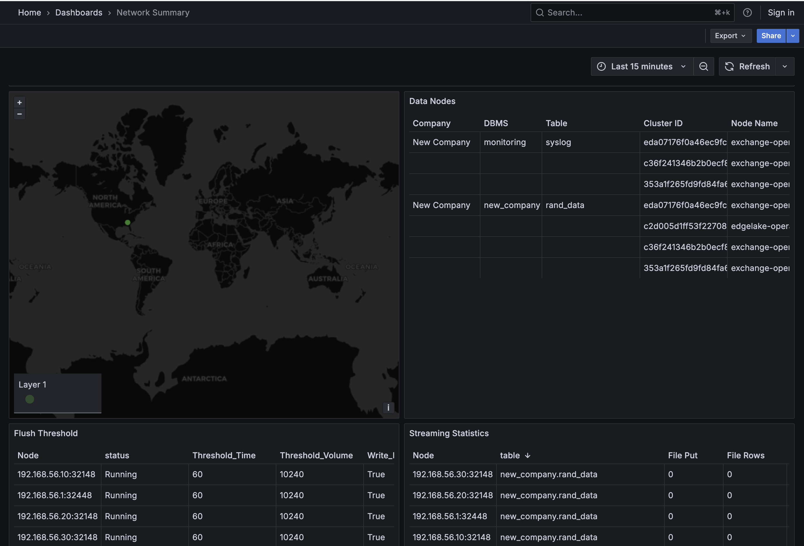
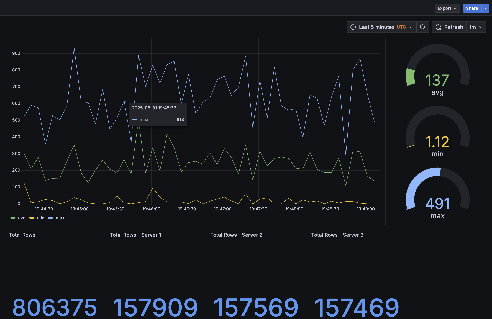
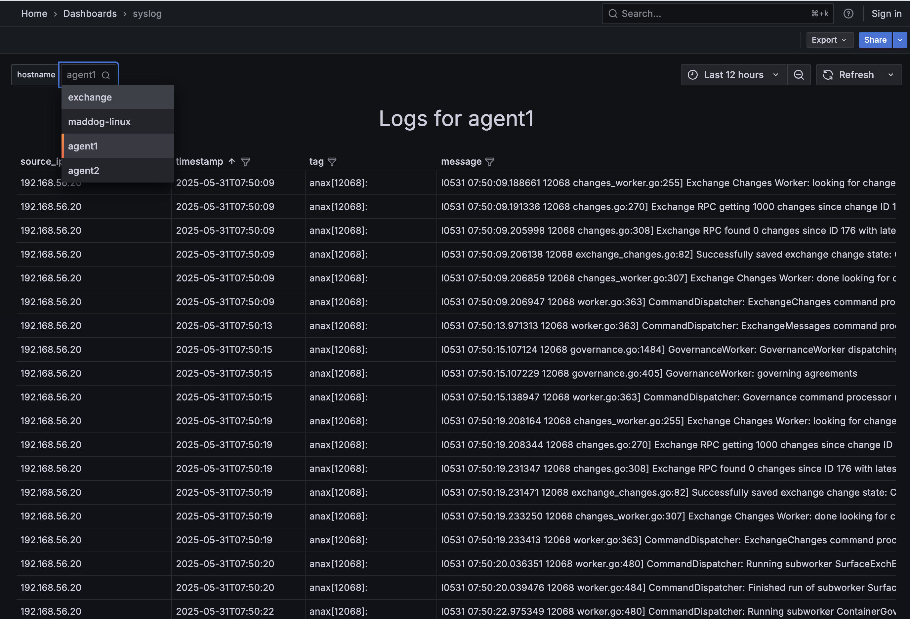

# Building Grafana


To run Docker, replace _DATASOURCE_ IP & port to the IP & port of the Query node 
```shell
docker run -p 3000:3000 \
  -e DATASOURCE_URL=http://139.177.201.33:32349 \
  --name grafana --rm anylogco/oh-grafana 
```

## Content 

**Grafana Config Files**: 
* [dashboards.yaml](dashboards.yaml)
* [datasource.yaml](datasource.yaml.tpl)
* [grafana.ini](grafana.ini)

**Dashboards**
* [summary.json](summary.json)

* [rand.json](rand.json)

* [syslog.json](syslog.json)


## Process
1. Deploy grafana 
```shell
docker run -it -d -p 3000:3000 --name grafana --rm grafana/grafana-oss
```


2. Create dashboards


3. Export dashboards as JSON - [directions](https://grafana.com/docs/grafana/latest/dashboards/share-dashboards-panels/#export-a-dashboard-as-json)

```text
   1. Click Dashboards in the main menu. 
   2. Open the dashboard you want to export. 
   3. Click the Export drop-down list in the top-right corner and select Export as JSON. 
   4. The Export dashboard JSON drawer opens. 
   5. Toggle the Export the dashboard to use in another instance switch to generate the JSON with a different data source UID. 
   6. Click Download file or Copy to clipboard. 
   7. Save JSON file(s)
   8. Click the X at the top-right corner to close the share drawer.
```


4. Create [datasource file](datasource.yaml.tpl) - this would contain EdgeLake REST connection information


5. Update _datasource_ value in dashboard JSON file(s)


6. Build [Docker image](Dockerfile). 
```shell
docker build -f Dockerfile . -t my-grafana
```

7. Stop Existing grafana + start with your grafana
```shell
docker run -it -d -p 3000:3000 --name grafana --rm my-grafana 
```
